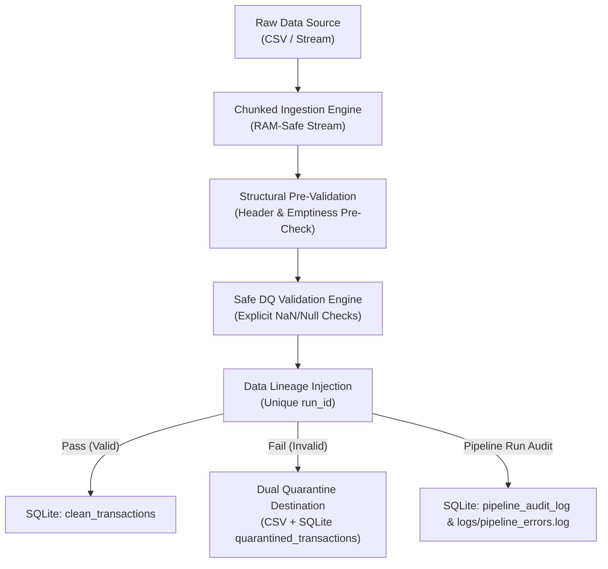

# Automated Data Quality & Pipeline Monitor: Complete Technical Deep Dive & Interview Guide

This document serves as an exhaustive, line-by-line architectural breakdown and interview preparation guide for the **Automated Data Quality & Pipeline Monitor** project built with Python, Pandas, and SQLite.

---

## Table of Contents
1. [Core Architectural Strategy](#1-core-architectural-strategy)
2. [Script Breakdown 1: `generate_mock_data.py`](#2-script-breakdown-1-generatemockdatapy)
3. [Script Breakdown 2: `pipeline.py`](#3-script-breakdown-2-pipelinepy)
4. [Database Schema & SQL Walkthrough](#4-database-schema--sql-walkthrough)
5. [Data Engineering Interview Speaking Points](#5-data-engineering-interview-speaking-points)

---

## 1. Core Architectural Strategy

When designing production-grade data pipelines, software engineering rigor must be applied to data handling. Three core design decisions anchor this system:



### A. Chunked Processing (`chunksize=250`)
- **The Problem**: Standard Pandas calls like `pd.read_csv('massive_file.csv')` load the entire dataset into main memory (RAM) at once as an in-memory DataFrame. If an operational file grows from megabytes to gigabytes or terabytes, the script will trigger an Out-Of-Memory (OOM) error and crash the runtime.
- **The Architectural Solution**: Using `pd.read_csv(filepath, chunksize=N)` converts file reading into a **Python generator / streaming iterator**. Instead of allocating space for 10,000,000 rows simultaneously, Python loads `N` rows into memory, validates and processes them, writes them to disk/DB, and immediately releases or reuses memory for the next chunk.
- **Trade-off & Consideration**: State management across chunks (such as global duplicate checking for `order_id`) requires explicitly maintaining out-of-chunk state (e.g., an in-memory `seen_order_ids` set or Redis cache).

### B. Dual-Destination Quarantining (CSV + SQLite)
- **The Problem**: In many naïve pipelines, bad data is simply dropped (`df.dropna()`). Dropping corrupted data leads to irreversible data loss, silent accounting mismatches, and zero auditability when upstream sources ask why expected metrics are missing.
- **The Architectural Solution**: Invalid records are isolated into a **quarantine workflow**:
  1. **Flat File CSV (`quarantine_transactions.csv`)**: Allows data stewards and operations teams to inspect failed records using standard tools (Excel, Python, BI) without needing DB read access.
  2. **SQLite Table (`quarantined_transactions`)**: Allows analytical querying (`GROUP BY rejection_reasons`) to quantify error patterns programmatically.

### C. Unique Batch Lineage (`run_id`)
- **The Problem**: Over time, data quality issues recur across multiple pipeline execution cycles. Without lineage identifiers, it is impossible to identify which pipeline execution imported a specific record or caused a spike in errors.
- **The Architectural Solution**: Every run generates a unique timestamped execution ID (e.g. `RUN-20260809-162605`). This `run_id` is stamped onto:
  - Every row in `clean_transactions`
  - Every row in `quarantined_transactions`
  - The audit summary in `pipeline_audit_log`
  - All log entries in `pipeline_errors.log`

---

## 2. Script Breakdown 1: `generate_mock_data.py`

This script synthesizes realistic e-commerce data while injecting controlled anomalies across ~25% of records to test the pipeline engine.

### Code Walkthrough

```python
import os
import random
import uuid
from datetime import datetime, timedelta
import pandas as pd

def generate_mock_data(output_path: str, num_records: int = 1000, anomaly_ratio: float = 0.25):
    os.makedirs(os.path.dirname(output_path), exist_ok=True)
    categories = ["Electronics", "Apparel", "Home & Kitchen", "Books", "Beauty", "Sports"]
    payment_methods = ["Credit Card", "PayPal", "Debit Card", "UPI"]
    statuses = ["Completed", "Pending", "Failed"]
    valid_domains = ["gmail.com", "yahoo.com", "outlook.com", "company.org"]
```
* **Directory Creation**: `os.makedirs(..., exist_ok=True)` ensures the target `data/` folder exists without raising an exception if it already present.
* **Controlled Domain Vocabularies**: Hardcoded valid sets allow generating predictable synthetic categorical variables.

#### Anomaly Generation Engine Logic
```python
    records = []
    base_time = datetime(2026, 8, 1, 10, 0, 0)
    existing_order_ids = []

    for i in range(1, num_records + 1):
        txn_id = f"TXN-{10000 + i}"
        order_id = f"ORD-{50000 + i}"
        customer_id = f"CUST-{random.randint(100, 999)}"
        email = f"user_{random.randint(100, 999)}@{random.choice(valid_domains)}"
        
        # Valid base attributes
        random_seconds = random.randint(0, 7 * 24 * 3600)
        txn_time = base_time - timedelta(seconds=random_seconds)
        txn_time_str = txn_time.strftime("%Y-%m-%d %H:%M:%S")
        unit_price = round(random.uniform(5.0, 500.0), 2)
        quantity = random.randint(1, 10)
        
        is_anomaly = (random.random() < anomaly_ratio)
```

#### Detailed Anomaly Injection Mechanics:
1. **Negative / Zero / NULL Price**:
   ```python
   if anomaly_type == "negative_price":
       unit_price = -round(random.uniform(10.0, 150.0), 2)
   elif anomaly_type == "zero_price":
       unit_price = 0.0
   elif anomaly_type == "null_price":
       unit_price = None  # Serializes as NaN in Pandas CSV
   ```
2. **Future Timestamp**:
   ```python
   elif anomaly_type == "future_date":
       future_time = datetime.now() + timedelta(days=random.randint(30, 365))
       txn_time_str = future_time.strftime("%Y-%m-%d %H:%M:%S")
   ```
3. **Missing Customer ID**:
   ```python
   elif anomaly_type == "missing_customer_id":
       customer_id = None
   ```
4. **Invalid Email Syntax**:
   ```python
   elif anomaly_type == "invalid_email_no_at":
       email = f"user_{random.randint(100, 999)}gmail.com"  # Missing @
   elif anomaly_type == "invalid_email_no_tld":
       email = f"user_{random.randint(100, 999)}@gmail"     # Missing top-level domain (.com/.org)
   ```
5. **Duplicate Order ID**:
   ```python
   elif anomaly_type == "duplicate_order_id" and len(existing_order_ids) > 0:
       order_id = random.choice(existing_order_ids)
   ```
6. **Invalid / Null Quantity**:
   ```python
   elif anomaly_type == "negative_quantity":
       quantity = -random.randint(1, 5)
   elif anomaly_type == "null_quantity":
       quantity = None
   ```

---

## 3. Script Breakdown 2: `pipeline.py`

`pipeline.py` is the execution engine responsible for ingestion, structural pre-validation, business rule enforcement, quarantining, and SQLite persistence.

### Step 1: Pre-Validation Logic
Before loading chunk iterators, the engine runs two fast pre-flight checks:

```python
def pre_validate_file(raw_csv_path: str, logger: logging.Logger) -> bool:
    if not os.path.exists(raw_csv_path):
        logger.critical(f"Pre-validation failed: Input file '{raw_csv_path}' does not exist.")
        return False
        
    if os.path.getsize(raw_csv_path) == 0:
        logger.critical(f"Pre-validation failed: Input file '{raw_csv_path}' is completely empty (0 bytes).")
        return False
        
    try:
        header_df = pd.read_csv(raw_csv_path, nrows=0)
        present_headers = list(header_df.columns)
        missing_headers = [h for h in REQUIRED_HEADERS if h not in present_headers]
        
        if missing_headers:
            logger.critical(f"Pre-validation failed: Missing required CSV headers: {missing_headers}")
            return False
            
        return True
    except Exception as e:
        logger.critical(f"Pre-validation failed due to CSV parsing error: {e}")
        return False
```
* **`nrows=0` Trick**: `pd.read_csv(raw_csv_path, nrows=0)` reads *only* line 1 of the file to extract column names in milliseconds without loading data rows.

---

### Step 2: Safe NaN/Null Handling & Business Validation Logic

```python
EMAIL_REGEX = re.compile(r"^[a-zA-Z0-9._%+-]+@[a-zA-Z0-9.-]+\.[a-zA-Z]{2,}$")

def validate_record(row: dict, seen_order_ids: set, current_time: datetime) -> list:
    reasons = []
    
    # Rule 01: Non-Null ID Check
    cust_id = row.get("customer_id")
    order_id = row.get("order_id")
    if pd.isna(cust_id) or str(cust_id).strip() == "":
        reasons.append("DQ_RULE_01: customer_id is NULL or blank")
        
    # Rule 02: Regex Email Check
    email = row.get("customer_email")
    if pd.isna(email) or not isinstance(email, str) or not EMAIL_REGEX.match(str(email).strip()):
        reasons.append(f"DQ_RULE_02: Invalid customer_email format ({email})")
        
    # Rule 03: Safe Price Check (Handling NaN before comparison)
    price = row.get("unit_price")
    if pd.isna(price):
        reasons.append("DQ_RULE_03: unit_price is NULL/NaN")
    else:
        try:
            val_price = float(price)
            if val_price <= 0:
                reasons.append(f"DQ_RULE_03: unit_price ({val_price}) must be > 0")
        except (ValueError, TypeError):
            reasons.append(f"DQ_RULE_03: unit_price ({price}) is not numeric")

    # Rule 06: Order Uniqueness Check across Chunks
    if order_id and not pd.isna(order_id):
        order_id_str = str(order_id).strip()
        if order_id_str in seen_order_ids:
            reasons.append(f"DQ_RULE_06: Duplicate order_id detected ({order_id_str})")
            
    return reasons
```

> **Why `pd.isna()` is critical**: In Python, `float('nan') > 0` returns `False`, but operating on `None` or invalid string types causes a runtime `TypeError: '>' not supported between instances of 'NoneType' and 'int'`. Wrapping numeric fields in `pd.isna()` and explicit `try...except` guarantees 100% crash-free execution.

---

### Step 3: Chunking Engine Mechanics

```python
    seen_order_ids = set()
    total_records = 0
    clean_records = []
    quarantine_records = []
    
    for chunk in pd.read_csv(raw_csv_path, chunksize=chunk_size):
        for _, row in chunk.iterrows():
            total_records += 1
            row_dict = row.to_dict()
            
            reasons = validate_record(row_dict, seen_order_ids, current_time)
            
            if reasons:
                row_dict["run_id"] = run_id
                row_dict["rejection_reasons"] = " | ".join(reasons)
                quarantine_records.append(row_dict)
            else:
                row_dict["run_id"] = run_id
                clean_records.append(row_dict)
                seen_order_ids.add(str(row_dict["order_id"]).strip())
```
* **Memory Management**: The `seen_order_ids` Python `set` maintains $O(1)$ lookup time for duplicate detection across chunks.

---

### Step 4: Database Connection & Transactional Persistence

```python
    conn = sqlite3.connect(db_path)
    
    # Write Clean Records to SQLite using Pandas to_sql
    if clean_records:
        clean_df = pd.DataFrame(clean_records)
        clean_df[cols].to_sql("clean_transactions", conn, if_exists="append", index=False)

    # Write Quarantined Records to CSV & SQLite
    if quarantine_records:
        quarantine_df = pd.DataFrame(quarantine_records)
        quarantine_df.to_csv(quarantine_csv_path, mode="a", index=False, header=not file_exists)
        quarantine_df[q_cols].to_sql("quarantined_transactions", conn, if_exists="append", index=False)

    # Insert Audit Metric Record
    cursor = conn.cursor()
    cursor.execute("""
        INSERT INTO pipeline_audit_log (run_id, run_timestamp, source_file, total_records, valid_records, quarantined_records, pass_rate, status)
        VALUES (?, ?, ?, ?, ?, ?, ?, 'SUCCESS')
    """, (run_id, run_timestamp, raw_csv_path, total_records, valid_count, quarantine_count, pass_rate))
    conn.commit()
    conn.close()
```
* **`if_exists="append"`**: Ensures new execution batches append cleanly into relational tables without overwriting historical data.

---

## 4. Database Schema & SQL Walkthrough

### 1. `clean_transactions`
Stores fully validated e-commerce transactions ready for downstream analytics.
```sql
CREATE TABLE clean_transactions (
    run_id TEXT NOT NULL,
    transaction_id TEXT PRIMARY KEY,
    order_id TEXT NOT NULL,
    customer_id TEXT NOT NULL,
    customer_email TEXT NOT NULL,
    transaction_timestamp TEXT NOT NULL,
    product_id TEXT NOT NULL,
    category TEXT,
    quantity INTEGER NOT NULL,
    unit_price REAL NOT NULL,
    payment_method TEXT,
    status TEXT,
    ingested_at TIMESTAMP DEFAULT CURRENT_TIMESTAMP
);
```

### 2. `quarantined_transactions`
Stores rejected records with full data context and appended error reasons.
```sql
CREATE TABLE quarantined_transactions (
    run_id TEXT NOT NULL,
    transaction_id TEXT,
    order_id TEXT,
    customer_id TEXT,
    customer_email TEXT,
    transaction_timestamp TEXT,
    product_id TEXT,
    category TEXT,
    quantity REAL,
    unit_price REAL,
    payment_method TEXT,
    status TEXT,
    rejection_reasons TEXT NOT NULL,
    quarantined_at TIMESTAMP DEFAULT CURRENT_TIMESTAMP
);
```

### 3. `pipeline_audit_log`
Stores high-level metadata for every execution run.
```sql
CREATE TABLE pipeline_audit_log (
    run_id TEXT PRIMARY KEY,
    run_timestamp TEXT NOT NULL,
    source_file TEXT NOT NULL,
    total_records INTEGER NOT NULL,
    valid_records INTEGER NOT NULL,
    quarantined_records INTEGER NOT NULL,
    pass_rate REAL NOT NULL,
    status TEXT NOT NULL
);
```

### Analytical Audit Queries for Data Engineers

#### Query 1: Top Data Quality Rejection Reasons in a Specific Batch
```sql
SELECT rejection_reasons, COUNT(*) as failure_count
FROM quarantined_transactions
WHERE run_id = 'RUN-20260809-162605'
GROUP BY rejection_reasons
ORDER BY failure_count DESC;
```

#### Query 2: Pipeline Pass Rate Trend Over Time
```sql
SELECT run_id, run_timestamp, total_records, pass_rate, status
FROM pipeline_audit_log
ORDER BY run_timestamp DESC;
```

---

## 5. Data Engineering Interview Speaking Points

When describing this project during a Data Engineering / Python job interview, use these structured talking points:

1. **Scalable Ingestion & RAM Management**:
   > *"Rather than relying on `pd.read_csv()` which loads entire datasets into RAM and risks Out-Of-Memory crashes, I engineered a chunked generator pipeline (`chunksize=250`). This streaming strategy ensures the pipeline consumes a flat memory profile regardless of input file scale."*

2. **Pre-Flight Structural Validation**:
   > *"To avoid wasting compute on broken files, I implemented a zero-overhead structural pre-check. By validating file non-emptiness and executing an `nrows=0` header check, the system halts with a `CRITICAL` error log before any data transformation begins if structural requirements aren't met."*

3. **Zero Data Loss Quarantine Pattern**:
   > *"Instead of dropping invalid data, I built a dual-destination quarantine strategy. Corrupted rows are stamped with specific rule failure reasons and persisted to both a flat CSV (for operational triage) and SQLite (for analytical SQL aggregation)."*

4. **Data Lineage & Auditability**:
   > *"I established full batch data lineage by stamping every valid and quarantined record with a unique batch `run_id`. This connects row-level persistence back to high-level metadata stored in `pipeline_audit_log` and `pipeline_errors.log`."*

5. **Defensive Typing & Null-Safety**:
   > *"To prevent runtime crashes from unexpected missing values or invalid data types, I built null-safe validation guards using `pd.isna()` and explicit type conversion before evaluating numerical boundary logic."*
