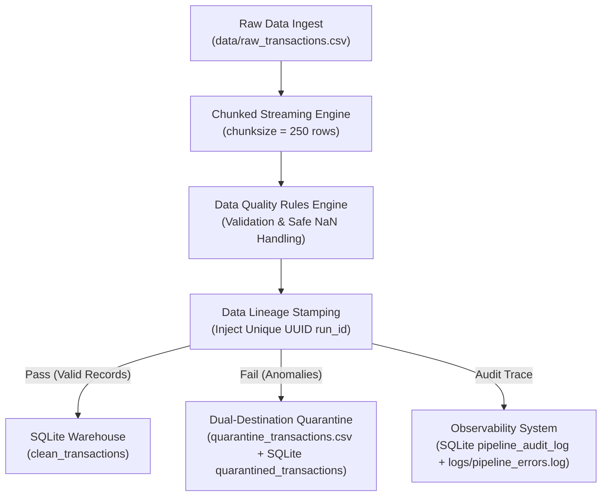

# Automated Data Quality & Pipeline Monitor 🚀


A production-grade, memory-safe Data Quality (DQ) & Pipeline Observability framework built with Python, Pandas, and SQLite. Designed with a **Zero-Loss Quarantine Architecture**, this engine ingests large streams of raw data, enforces business rules, isolates corrupted/anomalous records with tagged rejection reasons, and persists audit traces via a unique lineage `run_id`.

---

## 🏗️ System Architecture



---

## 🔥 Key Engineering Principles

1. **Memory-Safe Chunking ($O(1)$ RAM Footprint)**
   - Reads files using generator-based chunking (`chunksize=250`), guaranteeing a constant memory footprint even when processing multi-gigabyte files. Prevents `OutOfMemory` (OOM) crashes in resource-constrained containerized environments.
2. **Zero-Loss Quarantine Architecture**
   - Corrupted or invalid records are never silently dropped (`dropna()`). Instead, they are quarantined into both a flat CSV (`quarantine_transactions.csv`) and SQLite table (`quarantined_transactions`) along with an explicit `rejection_reason` for auditability by data stewards.
3. **Safe NaN & Type Parsing**
   - Employs strict null-handling and safe type conversion before arithmetic processing to prevent `TypeError` or silently propagating corrupt values.
4. **End-to-End Lineage Tracking (`run_id`)**
   - Every execution cycle generates a unique timestamped execution ID (UUID). This `run_id` tags clean destination tables, quarantine files, audit databases, and structured log files.
5. **Data Observability & Auditability**
   - Automatically writes run summaries (`total_processed`, `clean_count`, `quarantined_count`, `execution_time_sec`, `status`) to `pipeline_audit_log` for automated reporting and pipeline health monitoring.

---

## 📊 Data Quality Rules Matrix

| Field | Rule Description | Action on Failure | Rejection Reason Flag |
| :--- | :--- | :--- | :--- |
| `transaction_id` | Must be non-null and globally unique | Quarantined | `NULL_TRANSACTION_ID` / `DUPLICATE_TRANSACTION_ID` |
| `customer_id` | Must be non-null | Quarantined | `MISSING_CUSTOMER_ID` |
| `unit_price` / `amount` | Must be numeric and $> 0.00$ | Quarantined | `INVALID_AMOUNT` |
| `quantity` | Must be integer and $> 0$ | Quarantined | `INVALID_QUANTITY` |
| `timestamp` | Must follow ISO format (`YYYY-MM-DD HH:MM:SS`) & cannot be future date | Quarantined | `INVALID_TIMESTAMP` |

---

## 📁 Repository Structure

```text
Automated-Data-Quality-Monitor/
├── README.md                  # Comprehensive architectural documentation
├── PROJECT_DEEP_DIVE.md       # Technical interview prep & line-by-line guide
├── .gitignore                 # Excluded cache, environment, and build files
├── data/
│   ├── raw_transactions.csv           # Synthetic raw dataset with injected anomalies (~25%)
│   └── quarantine_transactions.csv    # Isolated bad records with explicit rejection reasons
├── database/
│   └── ecommerce_data.db              # Target SQLite database storing clean data & audit logs
├── logs/
│   └── pipeline_errors.log            # Structured pipeline log file
└── scripts/
    ├── generate_mock_data.py          # Anomaly injection mock data generator
    └── pipeline.py                    # Core ETL pipeline engine with validation & quarantine
```

---

## 🚀 Quickstart Guide

### Prerequisites
- Python 3.9+
- SQLite3 CLI (Optional for terminal queries)

### 1. Clone & Set Up
```bash
git clone https://github.com/YOUR_USERNAME/Automated-Data-Quality-Monitor.git
cd Automated-Data-Quality-Monitor
```

### 2. Generate Synthetic Mock Data (with ~25% Injected Anomalies)
```bash
python scripts/generate_mock_data.py
```
*Outputs: `data/raw_transactions.csv` containing ~1,000 raw transaction records.*

### 3. Execute the Data Quality Pipeline
```bash
python scripts/pipeline.py
```
*Outputs:*
- *Populates `clean_transactions`, `quarantined_transactions`, and `pipeline_audit_log` in `database/ecommerce_data.db`*
- *Generates `data/quarantine_transactions.csv`*
- *Appends structured log traces to `logs/pipeline_errors.log`*

---

## 🔍 Data Observability & Verification

### SQLite Database Verification

Run the SQLite CLI to inspect data routing:
```bash
sqlite3 database/ecommerce_data.db
```

```sql
.headers on
.mode column

-- 1. Check Overall Pipeline Metrics Across Runs
SELECT run_id, timestamp, total_processed, clean_count, quarantined_count, status 
FROM pipeline_audit_log 
ORDER BY timestamp DESC;

-- 2. Analyze Quarantined Anomaly Frequencies
SELECT rejection_reason, COUNT(*) AS total_count 
FROM quarantined_transactions 
GROUP BY rejection_reason 
ORDER BY total_count DESC;

-- 3. Query Clean Warehouse Transactions Sample
SELECT transaction_id, customer_id, amount, timestamp, run_id 
FROM clean_transactions 
LIMIT 5;
```

---

## 💡 Production Scaling & Design Considerations

- **Scaling to Distributed Computing**: The chunking and quarantine concepts cleanly map to PySpark (`df.filter()`, `df.withColumn()`) or DuckDB for multi-terabyte data warehouse streaming.
- **Airflow Orchestration**: `scripts/pipeline.py` is modularized to run natively within a DAG execution flow using Python Operators or KubernetesPod Operators.
- **Data Governance**: The zero-loss quarantine flat file enables self-service remediation for operational teams to correct bad records and re-ingest via backfill workflows.

---

## 📄 License
Distributed under the MIT License. See `LICENSE` for more information.
